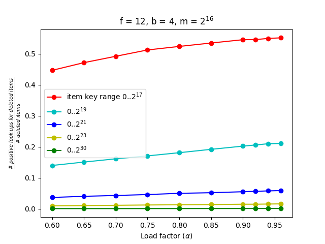

# Cuckoo Filters

Cuckoo filters, as opposed to Bloom filters, support deletion. d-left
Counting Bloom filters and Quotient filters do support deletion at the
cost of reduced space efficiency. However, cuckoo filters support
deletion while still storing only fingerprints.

The analysis in the paper mainly focuses on adjusting Cuckoo filter
parameters according to targeted false positive rate **e**. The
parameters are:

- **f** - size of fingerprint in bits
- **b** - size of bucket in fingerprints
- **m** - size of the whole filter in buckets
- **Alpha** - load factor

One of the important points of the paper is that deletion does not
affect the false positive rate. In other words, if we set **f** and
**b** for certain targeted **e**, deleting items from the filter
should not affect it. **e** is constant for the certain
configuration. The analysis on setting the correct parameters in the
paper is thorough (although not straightforward).

Since the correlation between **f**, **b**, **Alpha**, and **e** is
not straightforward, for some configurations that I have tested, there
were some (for me) unexpected outcomes. The outcomes started being
surprising when I started testing false positive rate after
deletion. The graph below illustrates what I actually saw.

Keys to insert in the filter are chosen uniformly at random from the
ranges noted in the legend.

Turns out that this might have been expected theoretically. As shown
in the graph, the far most important role is played by the range of
the keys. For the keys covering a large enough range, we see under 1%
false positives even with as high load factor as 96%.

The experiments shown in the paper apparently use random keys chosen
from 2^32 range.
